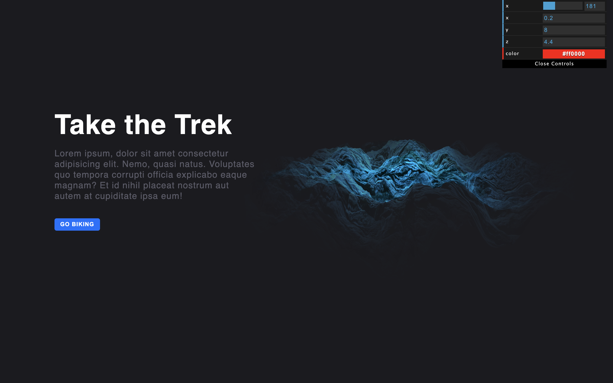

# <a href="https://threejs-terrain-starter.netlify.app/">ThreeJS Terrain</a>

<br>
</img>
<br>

<!-- <a href="https://www.youtube.com/watch?v=rJpA7ulK2rQ" target="_blank" >
 
</a> -->

<!-- <br> -->

<hr>
<hr>


# Project Description

A fictional landing page created using `ThreeJS` showing the use of `Displacement Maps`, `Textures`, and `Alpha Maps` to create this effect of a mountaineous terrain.

<br>

<hr>
<hr>

# Technologies Used


<br>
<hr>
<hr>

<!-- <br> -->

# Set Up

### Clone the repo.

```
git clone https://github.com/${GitHub Username}/threejs-terrain.git
```

<br>

### Open Terminal on the Folder

```
cd admin_dashboard
```

<br>

### Install the Dependencies

```
npm install
```

<br>

### Run the UI

```
npm run dev
or
yarn dev
```

<br>
<hr>

